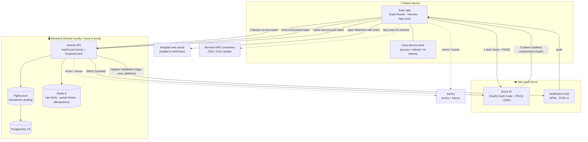
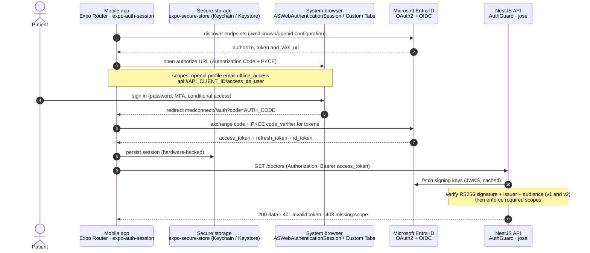

# MedConnect

MedConnect is a production-shaped portfolio project: an **enterprise healthcare patient app** (Expo / React Native) with a **NestJS backend**, wired to **Microsoft Entra ID** for real OAuth2/OIDC login, PostgreSQL + Redis for data and scale, Azure Notification Hub for push, and an optional **Re.Pack Module Federation** micro-frontend layer.

It is a pnpm + Turborepo monorepo. Everything runs locally in *mock* mode with a single command, and switches to *real Azure* by changing environment variables only.

---

## 1. What's inside (workspaces)

| Workspace | Stack | Responsibility |
| --- | --- | --- |
| `apps/mobile` | Expo SDK 57, React Native 0.86, Expo Router, New Arch + Hermes, TypeScript strict | The patient app: auth, appointments, booking, loyalty, portal WebView, push, widgets |
| `apps/api` | NestJS 12, Prisma, PostgreSQL, Redis, `jose` JWT validation | REST API and trust boundary: verifies every token, enforces scopes, owns data |
| `apps/portal-remote` | Re.Pack (Webpack 5) + Module Federation v2 | Independently deployable "Portal" micro-frontend (JS-only remote); see [`apps/mobile/REPACK-MF.md`](apps/mobile/REPACK-MF.md) |
| `packages/shared` | Zod | Shared schemas, DTOs and structured error codes used by mobile **and** API |
| `packages/mock-identity` | `jose` | Test-only signed JWT + JWKS so you can run the full stack without Azure |
| `packages/mf-contracts` | TypeScript | The typed host↔remote contract + the Module Federation `shared` singleton config |

---

## 2. Architecture & infrastructure



**Runtime lifecycle (happy path):**

1. The app signs the user in against **Entra ID** using **Authorization Code + PKCE** (public client, no secret).
2. Tokens are stored in **`expo-secure-store`** (never AsyncStorage). Every API call attaches `Authorization: Bearer <access_token>` and a correlation id.
3. The **API verifies the token** with `jose` (JWKS + issuer + audience + `RS256` + scopes) before any handler runs. It never trusts the client.
4. **Booking** locks the slot in a serializable transaction; retries are safe via an `Idempotency-Key`. **Redis** holds rate-limit counters, idempotency records and short-lived portal tickets. **PgBouncer** shields Postgres from connection storms.
5. **Push:** the app sends the *native* APNs/FCM device token; the API registers an Azure Notification Hub installation tagged with the user and platform.
6. **Micro-frontends:** UI is isolated per route (a crash in one tab never kills the app), and the Portal surface can be shipped as a runtime-loaded federated remote.

---

## 3. Repository structure

```text
medconnect/
├─ apps/
│  ├─ mobile/                 # Expo patient app
│  │  ├─ app/                 # Expo Router routes (file-based)
│  │  │  ├─ (app)/            #   authenticated tab group (index, appointments, book, portal, profile, …)
│  │  │  ├─ login.tsx
│  │  │  └─ _layout.tsx
│  │  ├─ src/
│  │  │  ├─ design/           # design system, theme, floating tab bar, RouteErrorBoundary
│  │  │  ├─ features/         # auth, appointments, loyalty, notifications, portal, profile, security
│  │  │  ├─ lib/              # api-client, env (zod), query-client, storage, theme
│  │  │  └─ repack/           # Re.Pack entry, ScriptManager, remote consumer (MFE, opt-in)
│  │  ├─ app.config.ts        # Expo config (CNG plugins, updates, widgets)
│  │  ├─ webpack.config.mjs   # Re.Pack host config (opt-in bundler; Metro stays default)
│  │  └─ REPACK-MF.md         # micro-frontend design + Gate 0 results + decisions
│  ├─ api/                    # NestJS backend
│  │  ├─ src/
│  │  │  ├─ auth/             # AuthGuard (jose JWT), ScopesGuard, decorators
│  │  │  ├─ appointments/ doctors/ loyalty/ notifications/ portal/ health/
│  │  │  ├─ idempotency/      # Idempotency-Key handling
│  │  │  ├─ mock-identity/    # local IdP (JWKS + token) for AUTH_MODE=mock
│  │  │  ├─ common/ config/ prisma/ redis/
│  │  │  └─ main.ts
│  │  └─ prisma/              # schema.prisma, migrations, seed
│  └─ portal-remote/          # federated "Portal" remote (Re.Pack container)
├─ packages/
│  ├─ shared/                 # Zod schemas, DTOs, error codes (mobile + API)
│  ├─ mock-identity/          # signed JWT / JWKS helpers (test only)
│  └─ mf-contracts/           # host↔remote contract + MF shared singletons
├─ scripts/
│  ├─ dev-all.mjs             # one-command local orchestration
│  └─ verify-entra.mjs        # prove real Entra tokens are accepted by the API
├─ load-tests/                # k6 scripts
├─ .maestro/                  # mobile E2E flows
├─ .github/workflows/         # CI (ci.yml) + per-remote publish (remotes.yml)
├─ docker-compose.yml         # postgres + redis + pgbouncer
├─ turbo.json                 # task pipeline
└─ .env.example               # the ONLY committed env file (placeholders only)
```

---

## 4. Authentication & Microsoft Entra ID (the full flow)

MedConnect supports two identity modes selected purely by env:

- **`mock`** (default): the API acts as a tiny local Identity Provider so you can run everything with zero Azure setup.
- **`entra`**: real Microsoft Entra ID via OAuth2 Authorization Code + PKCE.

The mobile client and the API are deliberately decoupled: the client only *obtains* a token, and the API *independently verifies* it. The same `AuthGuard` handles both modes; only the issuer, audience and JWKS change (selected in `apps/api/src/config/env.ts` from `AUTH_MODE`).

### 4.1 Sign-in sequence (real Entra)



### 4.2 Why these technologies

| Concern | Technology | Why it was chosen |
| --- | --- | --- |
| Interactive login | **`expo-auth-session`** (Authorization Code + **PKCE**) | A mobile app is a *public client* and cannot keep a secret; PKCE is the OAuth2 standard that protects the code exchange without one |
| Where the user types credentials | **System browser** (`ASWebAuthenticationSession` / Chrome Custom Tabs) | Credentials and SSO cookies never touch app-controlled JS; this is phishing-resistant and reuses the OS session |
| Token storage | **`expo-secure-store`** (iOS Keychain / Android Keystore) | Hardware-backed, encrypted at rest, unlike `AsyncStorage` |
| Token verification | **`jose`** (`createRemoteJWKSet` + `jwtVerify`, `RS256`) | Standards-based, independent verification against the IdP's public keys; the API never trusts the client |
| Contracts & config | **Zod** (shared DTOs + env schemas) | One source of truth validated at runtime on both mobile and API |
| Refresh safety | **single-flight mutex** (`refreshSingleFlight`) | Parallel 401s trigger exactly one refresh instead of a stampede |

### 4.3 Where it lives in code

**Client** (`apps/mobile/src/features/auth/auth-context.tsx`):
- `useAutoDiscovery` + `useAuthRequest({ usePKCE: true, redirectUri: "medconnect://auth" })` build the request.
- `exchangeCodeAsync` swaps the authorization code (plus `code_verifier`) for tokens; `token-store.ts` persists them.
- `getAccessToken()` transparently refreshes expired tokens via the single-flight mutex. `signOut()` clears the secure session; token revocation is best-effort (Entra publishes no revocation endpoint, so it is skipped rather than blocking logout).

**Server** (`apps/api/src/auth/auth.guard.ts`):
- `createRemoteJWKSet(JWKS_URI)` + `jwtVerify` with `issuer`, `audience` and `algorithms: ["RS256"]`.
- Accepts both **v1** (`aud = api://CLIENT_ID`) and **v2** (`aud = CLIENT_ID`) audiences.
- Derives the user from `oid`/`sub`, parses `scp` scopes, and `ScopesGuard` + `@RequireScopes(...)` enforce per-route permissions.

### 4.4 What we configured in Entra (and why)

| Item | Where in Entra | Value / setting | Why |
| --- | --- | --- | --- |
| Mobile **app registration** | App registrations → *New* | Platform: *Mobile and desktop applications* | The public client that performs interactive login |
| Redirect URI | Mobile app → Authentication | `medconnect://auth` | Matches the app's custom scheme so the browser returns the auth code to the app |
| Public client flows | Mobile app → Authentication | *Allow public client flows = Yes* | Enables PKCE / device-code without a client secret |
| API **app registration** | App registrations → *New* | separate registration | The resource the token is issued **for** |
| Exposed API scope | API app → Expose an API | `api://<API_CLIENT_ID>/access_as_user` | The delegated permission the app requests and the API requires |
| API permission grant | Mobile app → API permissions | add `access_as_user`, *Grant admin consent* if tenant requires | Lets the mobile client call the API scope |
| Access token version | API app → Manifest | `requestedAccessTokenVersion = 2` | Ensures v2 issuer (`login.microsoftonline.com/.../v2.0`) so `iss`/`aud` match the API config |

### 4.5 Values to env mapping

| Env var (mobile) | Copied from |
| --- | --- |
| `EXPO_PUBLIC_ENTRA_TENANT_ID` | Mobile app → Overview → *Directory (tenant) ID* |
| `EXPO_PUBLIC_ENTRA_CLIENT_ID` | Mobile app → Overview → *Application (client) ID* |
| `EXPO_PUBLIC_ENTRA_API_SCOPE` | API app → Expose an API → `api://<API_CLIENT_ID>/access_as_user` |
| `EXPO_PUBLIC_PORTAL_URL` | Your hospital web portal URL loaded in the WebView |

The API side must line up with the **same API registration**: `ENTRA_ISSUER = https://login.microsoftonline.com/<TENANT_ID>/v2.0`, `ENTRA_AUDIENCE = api://<API_CLIENT_ID>`, `ENTRA_JWKS_URI = https://login.microsoftonline.com/<TENANT_ID>/discovery/v2.0/keys`.

### 4.6 Verify the real wiring

`scripts/verify-entra.mjs` runs the **OAuth2 device-code flow** against your tenant, decodes the returned access token (prints `iss`/`aud`/`ver`/`scp`), checks them against `apps/api/.env`, and calls `GET /doctors` with the real token to prove the backend accepts it:

```bash
pnpm api                 # in one terminal
node scripts/verify-entra.mjs
```

`[PASS]` means Entra → API is correctly configured end to end.

### 4.7 Mock mode (no Azure)

With `AUTH_MODE=mock` the app POSTs to `/mock-identity/token`; the API mints a signed JWT via `@medconnect/mock-identity` and serves a JWKS at `/mock-identity/jwks`. The **same** `AuthGuard` verifies it (issuer/audience/JWKS just point at the mock IdP). Mock is **hard-blocked in production**: `loadEnv()` throws if `NODE_ENV=production` with `AUTH_MODE=mock` or `FEATURE_MOCK_IDENTITY=true`.

---

## 5. Run locally

```bash
corepack enable
pnpm install
pnpm dev:all
```

`pnpm dev:all` (`scripts/dev-all.mjs`) does the full sequence:

1. Creates `apps/api/.env` and `apps/mobile/.env` from `.env.example` if missing.
2. Starts Docker services (Postgres, Redis, PgBouncer) and waits for health.
3. Runs Prisma migrations and seeds fake doctors/slots.
4. Starts the NestJS API and waits for `http://localhost:4000/health`.
5. Starts the Expo app.

Default mode is `mock`, so no Azure is needed on day one: press "Zaloguj przez Entra ID"; in mock mode it gets a signed local token from the API.

Manual equivalent:

```bash
pnpm dev:infra
pnpm --filter @medconnect/api prisma:migrate
pnpm --filter @medconnect/api prisma:seed
pnpm api
pnpm mobile
```

**Infrastructure ports** (from `docker-compose.yml`): Postgres `5432` (direct), PgBouncer `6432` (pooled, used by `DATABASE_URL`), Redis `6379`.

---

## 6. Azure Notification Hub (push)

1. Create a Notification Hub namespace + hub (**Standard** tier for realistic traffic).
2. iOS: create an APNs key (`.p8`) in Apple Developer and upload it to Azure NH.
3. Android: create a Firebase project, enable **FCM v1**, configure Azure NH with the service-account values.
4. The app calls `Notifications.getDevicePushTokenAsync()` (native token, not an Expo push token).
5. The API stores the installation and creates/updates Azure NH installations with tags like `user:<oid>` and `platform:ios`.

---

## 7. Micro-frontends (optional Re.Pack layer)

Two levels of modularity:

- **Per-route isolation (always on):** every Expo Router route exports a `RouteErrorBoundary`, so a crash in one tab shows a local "screen crashed" state while the rest of the app keeps running; incidents are tagged and sent to Sentry.
- **Runtime remotes (opt-in):** `apps/portal-remote` is a Webpack 5 + Module Federation v2 container exposing `./PortalScreen`; the host loads it lazily via `ScriptManager` with an HTTPS allowlist, chunk signature verification, and a **built-in fallback** if the remote can't be fetched.

Metro + `expo start` remain the default bundler; Re.Pack is an additive, opt-in path. Full design, empirical Gate 0 results and the managed-vs-bare decision are in **[`apps/mobile/REPACK-MF.md`](apps/mobile/REPACK-MF.md)**.

---

## 8. Environment & secrets (nothing sensitive is committed)

**Guarantee:** `.gitignore` is configured so the **only** env file git may ever track is **`.env.example`** (placeholders only); real env files and every common secret/credential type are ignored:

- `.env`, `.env.*`, `apps/*/.env`, `packages/*/.env`, `**/.env*`, with an explicit allow-exception for `.env.example`.
- Keys/certs/profiles: `*.pem *.key *.p8 *.p12 *.jks *.keystore *.cer *.crt *.mobileprovision`.
- Service credentials: `google-services.json`, `GoogleService-Info.plist`, `*service-account*.json`, `azure-*credentials*.json`, `sentry.properties`, `.npmrc`, `.netrc`.
- Native build output and archives: `apps/mobile/ios/`, `apps/mobile/android/`, `*.ipa *.apk *.aab`.

Verify locally:

```bash
git ls-files "*.env*"                              # → nothing, or only .env.example (never a real .env)
git check-ignore apps/api/.env apps/mobile/.env    # → both printed = both ignored
git status --porcelain | findstr /I ".env"         # real .env files must NOT appear as staged/tracked
```

> Tip: run `gitleaks detect` (dev dependency at the repo root) before pushing any real cloud config.

`EXPO_PUBLIC_*` values are compiled into the app bundle and are **public identifiers by design** (tenant id, client id, scope, API URL) and are not secrets. True secrets (client secrets, NH connection strings, signing keys, DB passwords) belong only in the backend env / Azure Key Vault / CI OIDC federation, never in git.

---

## 9. Release (EAS)

```bash
cd apps/mobile
eas build --profile preview
eas build --profile production
eas submit --profile production
eas update --channel production
```

Use separate Entra app registrations, PostgreSQL, Redis and Notification Hub per environment (`dev`, `staging`, `prod`). Store secrets in Azure Key Vault or CI OIDC federation. Prisma production deploys use `prisma migrate deploy` (never `prisma db push`).

---

## 10. Testing

```bash
pnpm typecheck
pnpm lint
pnpm test
maestro test .maestro/login.yaml
maestro test .maestro/book-appointment.yaml
k6 run load-tests/appointments.k6.js
k6 run load-tests/slots.k6.js
```

---

## 11. Security notes

- **Backend trust boundary:** the API verifies every access token (JWKS, issuer, audience, `RS256`, scopes) and never trusts the mobile client.
- **Token storage:** `expo-secure-store` only; refresh uses a single-flight mutex.
- **Booking integrity:** serializable transaction returns `SLOT_ALREADY_BOOKED` under contention; `Idempotency-Key` prevents duplicate bookings on retry.
- **Portal WebView:** the app requests a short-lived portal ticket; the portal should exchange it for a `Secure; HttpOnly; SameSite` cookie; raw tokens are never injected into page JS. `originWhitelist` is defense-in-depth.
- **Logging:** correlation id flows mobile → API → logs/Sentry; `Authorization`, cookies, tokens, email and device tokens are redacted.
- **Optional hardening:** certificate pinning, root/jailbreak warning banner, per-remote chunk signing (see `REPACK-MF.md`).
```
